# John Stick — work streams (DAG) & agent checklist

**Purpose:** Topological order for **everything that ships the game**: code, **3D/2D art**, **audio**, **pipeline/tooling**, **documentation**, and **scheduled taste work** — not programming tasks only. Each stream names **what unlocks what**, what can run **in parallel**, and which **Cursor role rule** (`@.cursor/rules/…`) fits the work.

**Source:** `docs/GAME_PLAN.md` implementation spine + tiers `[E]`/`[C]`/`[N]`.

**How to use:** Check items `[x]` when done. Pick tasks whose **all** `Depends on` IDs are checked. **Parallel** = same wave, no dependency between them — assign different agents (or the same agent in sequence).

**Ops model (agentic crew):** You (visionary + product owner) set **direction, access, and approvals**. Agents adopt **@ roles** as domain experts (taste, prompts, export presets, physics tuning). Some streams are **blocked until you complete a USER step** (logins, API keys, Blender license, approving an MCP install). Those are first-class work items, not footnotes.

**How we work — iteration, not “versions”:** We improve what is already here in a **linear flow** until it meets the bar. **Waves** and **WS IDs** are **scheduling and dependencies**, not product releases (no “v1 / v2” workflow in this repo). **YAGNI:** keep the code minimal; if a path is **unused or superseded**, **delete it** and move on — don’t maintain parallel “legacy” implementations. **Assets** may stay when they are **options to choose from**, **references**, or **inspiration**. **Docs** that are wrong or stale should be **updated or removed**, not left as historical noise. **`docs/FUTURE_MAYBE.md`** is for **maybes** until something **graduates into a work stream** (or is cut); it exists to separate “not scheduled yet” from “explicitly optional idea,” not to version the game.

**Taste is a ticket:** **Wave 15** schedules **play → feel wrong → fix** as **explicit deliverables** (tuning tables, prompt packs, multi-option gens, **USER pick**, revision log). Creative Director, Art Director, and Lead Game Designer **own** those streams; they are not implied by “polish later.” **Body feel:** taste passes explicitly chase **less rigid / more flowy** motion (slightly **bendy** limbs, natural recovery arcs) while keeping **readability** — implementation may span **WS-139** (strike / procedural layer), **WS-133** (rig + clip quality), and **WS-155** (player vs dummy thresholds), not the KCC **capsule** (invisible physics proxy only).

---

## Legend

| Field | Meaning |
|--------|---------|
| **Wave** | Rough phase (lower = earlier). |
| **Depends on** | IDs that must be done first (DAG edges). |
| **∥** | **Safe to parallelize** with listed IDs (same prerequisites, no edge between them). |
| **@rule** | Suggested Cursor rule file (see `john-stick-role-index.mdc`). |
| **GP §** | `GAME_PLAN` ingredient anchor (optional). |
| **USER** | **Human (you) prerequisite** — account, token, browser session, legal OK, hardware; no agent can finish this without you. |
| **Artifact** | Expected output type: **code**, **3D asset** (glTF etc.), **2D/generated** (refs, icons, textures), **audio**, **doc**, or **pipeline** (scripts, MCP, SOP). |
| **Tool** | Examples only (Blender, browser, image/SFX generators); **replaceable** — the stream stays valid if the specific tool changes. |
| **Round** | For **Wave 15** taste streams: minimum **USER review cycles** (e.g. ≥2) and/or **gen A/B option count** before sign-off — written in each WS **Build** block. |

---

## GAME_PLAN index → work streams (coverage)

`docs/GAME_PLAN.md` is the **ingredient list**; this file is the **schedule**. Most `[E]` items are covered by **earlier waves** (dojo + combat path). Gaps fell into: **implicit** (shipped inside another WS without a line item), **not yet pulled forward** (`WS-200+` bucket), or **missing** — filled by **later waves**, **taste passes**, and bucket items as priorities shift.

| GP region | Primary WS (or bucket) | Gap addressed |
|-----------|----------------------|---------------|
| §1.1.2 cause→effect | WS-062, WS-070–073, WS-091, WS-094 | — |
| §1.1.1 one-vs-many | **WS-201** | Crowd readability + AI — **WS-201** bucket until pulled forward |
| §1.1.3 sensory density | WS-071–073, WS-072, WS-133+ | Coherence **WS-141**; **material / particle shader** work **WS-139**, **WS-141** (incl. hit-burst upgrades after WS-073); **fullscreen post** **WS-216**; **taste pass WS-150–153** |
| §1.2.2 multi-level | WS-112 stub + **WS-201** | Objectives / director in WS-201 |
| §1.3.3 perf + §11.1.x | **WS-135** (new) | Min-spec + stress + cold-start |
| §1.3.2 combat readability | WS-060, WS-030 | **Telegraph + timing taste WS-151** |
| §2.1.2 target states (feel) | WS-090, WS-091, WS-094 | **WS-095** (enemy stance / receive); **Feel matrix + USER tuning WS-155** |
| §2.3.2 training / enemy tiers (feel) | WS-062, WS-092 | **WS-155** (bag / dummy / NPC read) |
| §2.1.1 strike loop (moment feel) | WS-080, WS-081 | **WS-151** (poke / launcher / sweep read) |
| §1.3.1 “fun in 60s” + §1.1.3 density | WS-101, juice | **WS-150** pillars + **WS-157** loops |
| §3.1.x camera comfort | WS-030–031, WS-071 | **WS-152** (USER session + deltas) |
| §3.4.1 playtest loop | WS-120 | **WS-157** structured rounds **before** final WS-120 sign-off |
| §5.1.1 silhouette | WS-041, WS-133 | **WS-154** multi-option gen + USER pick |
| §4.1.2 art direction (taste) | WS-100, WS-141 | **WS-154** + **WS-150** rubric alignment |
| §8.x mix / loudness taste | WS-072, WS-140 | **WS-153** A/B + USER ladder |
| §12.1 creative leadership | Roles | **WS-150** documented pillars + juice rubric |
| §11.2 cuts / scope | WS-120 | **WS-156** explicit taste-based cut list **feeds** WS-120 |
| §2.1.1 strike loop roles + moment feel | **WS-138** + **WS-095** + WS-080/081 | **WS-151** telegraph/timing taste |
| §2.1.3 risk/reward | **WS-201** + **WS-138** | Dojo-light until extra levels |
| §2.2.2 cancels / caps | **WS-138** (new) | Explicit designer rules |
| §2.2.3 hit-type data | Partial in compounds | **WS-138** audit vs table; **WS-095** enemy receive tiers |
| §2.3.3 pacing | **WS-201** | Per-level curves |
| §2.4.3 micro-challenges | **WS-210** deferred | |
| §2.5.2 load/restart | WS-112 | Optional persist → **WS-218** |
| §2.5.3 local score UI | **WS-208** deferred | |
| §3.2.3 buffer / coyote | Partial WS-051 | Full pass **WS-207** deferred |
| §3.2.5 gamepad | **WS-211** deferred | |
| §3.3.3 slopes/stairs | **WS-137** (new) | |
| §3.3.2 root-motion policy | **WS-137** (new) | Doc + implementation alignment |
| §3.1.3 camera accessibility | Juice hooks exist | **WS-212** deferred (turn speed, shake/flash) |
| §4.1.2 art direction lock | WS-100 + **WS-141** | Character+world coherence |
| §4.1.3 post FX (fullscreen) | **WS-216** deferred | Per-object **shaders** **WS-139** / **WS-141**; **WS-100** baseline shipped; **WS-113** gates cost |
| §4.3.2 actor model | **WS-135** audit bullet | Composability refactor plan |
| §4.4.5 cold-start | **WS-135** | |
| §4.4.3 telemetry | **WS-217** deferred | |
| §5.1.3 hit feedback rules | **WS-139** | Beyond generic VFX burst |
| §5.2.2 strike blending | **WS-139** | Key vs procedural policy |
| §5.2.x motion source of truth (rig + clips + physics read) | **WS-133**, **WS-139**, WS-091/094 | **WS-223**: **one** stack — neutral base glb + **full strike/loco clip catalog** + **same** bone map for clips and ragdoll (documented handoffs, no separate “physics edition”) |
| §5.3.2 material variants | **WS-134** | Outfit masks / instances |
| §6.2.3 crowd knockback | **WS-201** / **WS-219** | Perf + falloff with mobs |
| §6.3.3 bag-specific juice | **WS-141** (new) | Swing / spring / **bag + hit-burst** materials; WS-073 = shipped hit-burst baseline only |
| §6.4.3 determinism | **WS-218** deferred | |
| §7.2.3 lighting identity | WS-100, WS-020 | Env art pass |
| §7.2.2 spawn markers | **WS-222** deferred | Planner convenience |
| §7.3.x mission template | **WS-201** | |
| §7.4 diegetic story | **WS-200** | |
| §8.1.1 impact library | WS-072 first pass | **WS-140** breadth + stingers |
| §8.1.3 music | **WS-140** | Philosophy + loop/stinger |
| §8.2.3 dynamic mix | **WS-140** | Optional low-pass under chaos |
| §9.1.3 floating damage | **WS-213** deferred | |
| §9.2.3 remap UI | **WS-214** deferred | |
| §9.3.1 sign hierarchy | WS-101 | Deep structure / beats **WS-221** deferred |
| §9.3.2 progressive hints | **WS-215** deferred | |
| §10.x narrative/factions | WS-200, WS-201, WS-202, WS-134 | |
| §11.2.3 browser matrix | **WS-136** (new) | Chrome / Firefox / Safari |
| §12.x roles | `john-stick-role-index.mdc` | Staffing map, not a WS |

*Many one-to-one rows are omitted* (e.g. §4.3.1 → WS-010, §4.2.1–4.2.3 → WS-011, §6.2.1 → WS-060) — this table highlights **splits**, **bundles**, and **gaps** only.

---

## DAG overview (Mermaid)

*Arrows = “must complete before”. Tasks in the same row after a join can often run in parallel once their shared deps are met.*

```mermaid
flowchart TB
  subgraph W0["Wave 0 — Bootstrap"]
    WS001[WS-001 Shell]
    WS002[WS-002 Layout]
  end

  subgraph W1["Wave 1 — Runtime"]
    WS010[WS-010 Game loop]
    WS011[WS-011 Physics engine]
  end

  subgraph W2["Wave 2 — World shell"]
    WS020[WS-020 Scene render]
    WS021[WS-021 Dojo floor + bounds]
  end

  subgraph W3["Wave 3 — Camera"]
    WS030[WS-030 Follow cam]
    WS031[WS-031 Cam collision]
    WS032[WS-032 Facing yaw A/D]
  end

  subgraph W4["Wave 4 — Player"]
    WS040[WS-040 Capsule move + jump]
    WS041[WS-041 Stick mesh rig]
  end

  subgraph W5["Wave 5 — Input"]
    WS050[WS-050 Bindings 4 limbs + mod]
    WS051[WS-051 Chord interpreter]
  end

  subgraph W6["Wave 6 — First hit"]
    WS060[WS-060 Hit detection]
    WS061[WS-061 Heavy bag physics]
    WS062[WS-062 Hit resolve + impulse]
  end

  subgraph W7["Wave 7 — Juice"]
    WS070[WS-070 Event bus]
    WS071[WS-071 Hit-stop + FOV punch]
    WS072[WS-072 SFX + buses]
    WS073[WS-073 Hit VFX burst]
  end

  subgraph W8["Wave 8 — Moveset"]
    WS080[WS-080 3 other limbs]
    WS081[WS-081 Compound chords]
  end

  subgraph W9["Wave 9 — Ragdoll"]
    WS090[WS-090 Dummy + AI FSM]
    WS091[WS-091 Ragdoll + recover]
    WS092[WS-092 Stagger tuning]
    WS093[WS-093 Dojo harmless NPC]
    WS094[WS-094 Limb ragdoll]
  end

  subgraph W10["Wave 10 — Dojo UX"]
    WS100[WS-100 Blockout art pass]
    WS101[WS-101 Signs + interact]
    WS102[WS-102 HUD prompts]
  end

  subgraph W11["Wave 11 — Meta flow"]
    WS110[WS-110 Title → play]
    WS111[WS-111 Pause + help]
    WS112[WS-112 Level order + restart]
    WS113[WS-113 Settings presets]
  end

  subgraph W12["Wave 12 — Lock"]
    WS120[WS-120 Playtest + tuning]
  end

  subgraph W13["Wave 13 — Production art & creative tooling"]
    WS130[WS-130 Access + secrets layout]
    WS131[WS-131 DCC / MCP / automation spike]
    WS132[WS-132 Creative gen capability map]
    WS133[WS-133 Hero stickman DCC]
    WS134[WS-134 Modular limb outfits]
  end

  subgraph W14["Wave 14 — GP closure: perf, platforms, combat polish"]
    WS135[WS-135 Perf + budgets + cold-start]
    WS136[WS-136 Cross-browser matrix]
    WS137[WS-137 Slopes + root-motion policy]
    WS138[WS-138 Combo caps + hit-type audit]
    WS095[WS-095 Enemy stance + receive]
    WS139[WS-139 Strike blend + hit flash rules]
    WS140[WS-140 Audio depth + music]
    WS141[WS-141 Bag juice + art lock]
  end

  subgraph W15["Wave 15 — Taste & USER iteration (first-class tickets)"]
    WS150[WS-150 Pillars + juice rubric]
    WS151[WS-151 Combat timing + reads]
    WS152[WS-152 Camera comfort]
    WS153[WS-153 Mix + loudness taste]
    WS154[WS-154 Visual gen option rounds]
    WS155[WS-155 Target feel matrix]
    WS156[WS-156 Taste-based cut list]
    WS157[WS-157 Scheduled playtest rounds]
  end

  WS001 --> WS010
  WS001 --> WS011
  WS002 --> WS010

  WS010 --> WS020
  WS011 --> WS021
  WS020 --> WS030
  WS010 --> WS030
  WS030 --> WS031
  WS030 --> WS032

  WS011 --> WS040
  WS032 --> WS040
  WS020 --> WS040
  WS020 --> WS041

  WS040 --> WS050
  WS050 --> WS051

  WS050 --> WS060
  WS040 --> WS060
  WS021 --> WS061
  WS011 --> WS061
  WS060 --> WS062
  WS061 --> WS062

  WS062 --> WS070
  WS070 --> WS071
  WS070 --> WS072
  WS070 --> WS073

  WS062 --> WS080
  WS051 --> WS081
  WS080 --> WS081

  WS062 --> WS090
  WS090 --> WS091
  WS091 --> WS092
  WS091 --> WS093
  WS091 --> WS094
  WS041 --> WS094

  WS021 --> WS100
  WS050 --> WS101
  WS030 --> WS101
  WS101 --> WS102

  WS040 --> WS110
  WS050 --> WS111
  WS110 --> WS112
  WS020 --> WS113

  WS081 --> WS120
  WS092 --> WS120
  WS102 --> WS120
  WS112 --> WS120

  WS041 --> WS133
  WS132 --> WS133
  WS131 -.-> WS133
  WS133 --> WS134
  WS133 -.-> WS120

  WS113 --> WS135
  WS094 --> WS135
  WS112 --> WS136
  WS040 --> WS137
  WS021 --> WS137
  WS081 --> WS138
  WS092 --> WS095
  WS081 --> WS095
  WS081 --> WS139
  WS041 --> WS139
  WS072 --> WS140
  WS061 --> WS141
  WS070 --> WS141
  WS100 -.-> WS141
  WS135 -.-> WS120
  WS136 -.-> WS120

  WS150 --> WS156
  WS150 --> WS157
  WS112 --> WS157
  WS157 --> WS156
  WS081 --> WS151
  WS071 --> WS151
  WS138 --> WS151
  WS095 --> WS151
  WS030 --> WS152
  WS031 --> WS152
  WS071 --> WS152
  WS140 --> WS153
  WS132 --> WS154
  WS133 --> WS154
  WS061 --> WS155
  WS094 --> WS155
  WS093 --> WS155
  WS095 -.-> WS155
  WS150 -.-> WS120
  WS151 -.-> WS120
  WS152 -.-> WS120
  WS153 -.-> WS120
  WS154 -.-> WS120
  WS155 -.-> WS120
  WS156 -.-> WS120
  WS157 -.-> WS120
```



---

## Quick reference table

| ID | Wave | Depends on | ∥ Parallel | @rule | Deliverable (short) |
|----|------|------------|------------|-------|------------------------|
| WS-001 | 0 | — | WS-002 | `role-web-tools-engineer` + `role-graphics-programmer` | Vite+TS+Three runs; blank frame |
| WS-002 | 0 | — | WS-001 | `@.cursor/rules/role-game-director.mdc` (Game Director) | `src/` layout, naming doc |
| WS-010 | 1 | WS-001 | WS-011 | `role-gameplay-programmer` | `update` / `fixedStep` / `render` |
| WS-011 | 1 | WS-001 | WS-010 | `role-physics-programmer` | Rapier world + floor + layers; loop hooks GP §4.2 |
| WS-020 | 2 | WS-010 | WS-021 | `role-graphics-programmer` | Lights, shadows, renderer config GP §4.1.1 |
| WS-021 | 2 | WS-011, WS-010 | WS-020 | `role-level-designer` + `role-physics-programmer` | Floor + bounds GP §7.2.1 |
| WS-030 | 3 | WS-020, WS-010 | — | `role-gameplay-programmer` | Fixed-pitch follow GP §3.1.1 |
| WS-031 | 3 | WS-030 | WS-032 | `role-gameplay-programmer` | Pull-in / collision GP §3.1.1 |
| WS-032 | 3 | WS-030 | WS-031 | `role-gameplay-programmer` | Facing yaw (A/D + strafe) GP §3.1.4 |
| WS-040 | 4 | WS-011, WS-032, WS-020 | WS-041 | `role-gameplay-programmer` + `role-physics-programmer` | Move + jump GP §3.3.1 |
| WS-041 | 4 | WS-020 | WS-040 | `role-technical-animator` + `role-character-artist` | glTF stick + walk cycle GP §5.2.1 |
| WS-050 | 5 | WS-040 | — | `role-gameplay-programmer` | 4 keys + Shift + interact GP §3.2.1 |
| WS-051 | 5 | WS-050 | — | `role-gameplay-programmer` | Chords + priority + coyote GP §3.2.3–3.2.4 |
| WS-060 | 6 | WS-050, WS-040 | WS-061 | `role-gameplay-programmer` | Hitbox + debug draw GP §6.2.1 |
| WS-061 | 6 | WS-011, WS-021 | WS-060 | `role-physics-programmer` + `role-level-designer` | Bag anchor GP §7.1.2 |
| WS-062 | 6 | WS-060, WS-061 | — | `role-gameplay-programmer` | Impulse + reaction on bag GP §2.4.1 |
| WS-070 | 7 | WS-062 | — | `role-gameplay-programmer` | `CombatHit` events GP §4.3.3 |
| WS-071 | 7 | WS-070 | WS-072, WS-073 | `role-gameplay-programmer` + `role-creative-director` | Hit-stop, FOV punch GP §6.3.1 |
| WS-072 | 7 | WS-070 | WS-071, WS-073 | `role-audio` | Web Audio buses + 1st SFX GP §8.2.1 |
| WS-073 | 7 | WS-070 | WS-071, WS-072 | `role-vfx-artist` + `role-graphics-programmer` | Burst / flash GP §6.3.2 |
| WS-080 | 8 | WS-062 | done | `role-lead-game-designer` + `role-gameplay-programmer` + `role-technical-animator` | 3 limbs + table (+ recovery) GP §2.2.1 |
| WS-081 | 8 | WS-051, WS-080 | done | `role-lead-game-designer` + `role-technical-animator` + `role-gameplay-programmer` | Compounds + hit profile + recovery GP §2.2.1–2.2.3 |
| WS-090 | 9 | WS-062 | done | `role-gameplay-programmer` | Dummy + states GP §2.1.2 |
| WS-091 | 9 | WS-090, WS-011 | — | `role-physics-programmer` + `role-technical-animator` | Ragdoll + get-up GP §6.1 |
| WS-092 | 9 | WS-091 | — | `role-lead-game-designer` + `role-physics-programmer` | Threshold tuning GP §6.1.2 |
| WS-093 | 9 | WS-091, WS-040, WS-041 | WS-092 | `role-gameplay-programmer` + `role-lead-game-designer` | Harmless dojo NPC wander + hits; juice QA GP §2.3.2 |
| WS-094 | 9 | WS-091, WS-041 | WS-092 | `role-physics-programmer` + `role-technical-animator` | **Articulated** ragdoll (multi-body + joints) GP §5.2.1, §6.1, §6.4 |
| WS-095 | 14 | WS-092, WS-081 | WS-138, WS-139 | `role-lead-game-designer` + `role-gameplay-programmer` + `role-physics-programmer` | Enemy stance + receive: light hits stay up; KD from buildup or tiers GP §2.2.3, §6.1.2 |
| WS-100 | 10 | WS-021 | WS-101 | `role-environment-artist` + `role-art-director` | Replace placeholder geo GP §7.1 |
| WS-101 | 10 | WS-050, WS-030 | WS-100 | `role-level-designer` + `role-narrative-designer` | Signs + interact GP §2.4.2 |
| WS-102 | 10 | WS-101 | — | `role-ux-ui-designer` | Context prompts GP §9.1.2 |
| WS-110 | 11 | WS-040 | WS-113 | `role-ux-ui-designer` + `role-gameplay-programmer` | Title → dojo GP §9.2.1 |
| WS-111 | 11 | WS-050 | WS-113 | `role-ux-ui-designer` + `role-gameplay-programmer` | Pause + binding help GP §9.3.3 |
| WS-112 | 11 | WS-110 | — | `role-gameplay-programmer` + `role-web-tools-engineer` | `levelOrder` + restart GP §2.5 |
| WS-113 | 11 | WS-020 | WS-110, WS-111 | `role-graphics-programmer` + `role-ux-ui-designer` | Low/med/high presets **+ shader / post feature flags** GP §9.2.2 |
| WS-120 | 12 | WS-081, WS-092, WS-102, WS-112 | — | `role-qa-playtest` + `role-game-director` | Rubric pass, cut list GP §11.2 |
| WS-130 | 13 | — | WS-131, WS-132 | `role-web-tools-engineer` + **USER** | Env + key slots; no secrets in repo |
| WS-131 | 13 | — | WS-130, WS-132 | `role-technical-artist` + `role-web-tools-engineer` | MCP vs CLI vs browser SOP |
| WS-132 | 13 | — | WS-130, WS-131 | `role-art-director` + `role-creative-director` | Art/audio **classes** of generation (tool-agnostic) |
| WS-133 | 13 | WS-041, WS-132 | WS-131 | `role-character-artist` + `role-technical-artist` + `role-technical-animator` | Hero glTF; refs + `CHARACTER_RIG_MAP` |
| WS-134 | 13 | WS-133 | WS-100 | `role-character-artist` + `role-gameplay-programmer` + `role-technical-artist` | Per-limb swap / mix-match outfits |
| WS-135 | 14 | WS-011, WS-020, WS-094, WS-113 | WS-136 | `role-graphics-programmer` + `role-physics-programmer` + `role-qa-playtest` | Min-spec + ragdoll stress + cold-start + **shader/post GPU budget** GP §1.3.3 §11.1 |
| WS-136 | 14 | WS-112 | WS-135 | `role-web-tools-engineer` + `role-qa-playtest` | Chrome / Firefox / Safari pass GP §11.2.3 |
| WS-137 | 14 | WS-040, WS-021 | WS-100 | `role-physics-programmer` + `role-technical-animator` | Slopes/stairs + root-motion doc GP §3.3 |
| WS-138 | 14 | WS-081 | WS-139 | `role-lead-game-designer` + `role-gameplay-programmer` | Combo caps + hit-type audit GP §2.2 |
| WS-139 | 14 | WS-081, WS-041 | WS-133 | `role-technical-animator` + `role-art-director` + `role-graphics-programmer` | Strike blend + **anti-stiff** body/limb motion + hit flash / **rim / toon** shaders GP §5.2 §5.1 |
| WS-140 | 14 | WS-072 | WS-133 | `role-audio` + `role-creative-director` | Impact library + music + mix GP §8.1 §8.2 |
| WS-141 | 14 | WS-061, WS-070 | WS-100 | `role-vfx-artist` + `role-graphics-programmer` + `role-art-director` | Bag + **WS-073** hit-burst **shader iter** + dojo large-surface mats + **PBR / physical / deform** + §4.1.2 lock |
| WS-150 | 15 | — | WS-151–WS-155 | `role-creative-director` + **USER** | Pillars + rubric incl. **flowy / not pipe-stiff** body read; gates cuts + playtests |
| WS-151 | 15 | WS-081, WS-071, WS-138, WS-095 | WS-152, WS-155 | `role-lead-game-designer` + `role-gameplay-programmer` + **USER** | Timing + reads + **anti-stiff** windup/recovery; tuning tickets |
| WS-152 | 15 | WS-030, WS-031, WS-071 | WS-153 | `role-gameplay-programmer` + `role-creative-director` + **USER** | Camera comfort session → delta list (cam + juice) |
| WS-153 | 15 | WS-140 | WS-154 | `role-audio` + `role-creative-director` + **USER** | Mix A/B, loudness ladder, duck/sidechain taste |
| WS-154 | 15 | WS-132, WS-133 | WS-155 | `role-art-director` + `role-character-artist` + **USER** | Prompt packs; ≥2 options/class; USER pick + revision log |
| WS-155 | 15 | WS-061, WS-093, WS-094 | WS-151–WS-154, WS-157 | `role-lead-game-designer` + `role-physics-programmer` + **USER** | Target matrix + **soft/bendy vs rigid** tuning (player mesh + ragdolls) |
| WS-156 | 15 | WS-150, WS-157 | — | `role-game-director` + `role-creative-director` + **USER** | Explicit ship-scope cuts / deferrals → feeds WS-120 cut list |
| WS-157 | 15 | WS-112, WS-150 | WS-151–WS-155 | `role-qa-playtest` + `role-game-director` + **USER** | ≥N scripted playtest rounds before final WS-120 sign-off |

---

## Nested checklist (copy-friendly)

### Wave 0 — Bootstrap

- [x] **WS-001** — Vite + TypeScript + Three.js app runs; renderer clears; **no backend**.  
  - **Depends:** —  
  - **∥** WS-002  
  - **@** `role-web-tools-engineer` · `role-graphics-programmer`  
  - **GP** §4.4.1–4.4.2  

- [x] **WS-002** — Repo layout (`src/game`, `assets`, conventions) + README dev command.  
  - **Depends:** —  
  - **∥** WS-001  
  - **@** `@.cursor/rules/role-game-director.mdc` (Game Director — scope, sequencing, layout contract)  

### Wave 1 — Runtime core

- [x] **WS-010** — Game loop: `update`, `fixedStep` (~60Hz), `render`; no sim in render.  
  - **Depends:** WS-001  
  - **∥** WS-011  
  - **@** `role-gameplay-programmer`  
  - **GP** §4.3.1  

- [x] **WS-011** — Physics engine integrated; static floor; gravity; layers stub.  
  - **Depends:** WS-001  
  - **∥** WS-010  
  - **@** `role-physics-programmer`  
  - **GP** §4.2.1–4.2.3  

### Wave 2 — World shell

- [x] **WS-020** — Scene: lights, shadows, tone mapping, resize handling.  
  - **Depends:** WS-010  
  - **∥** WS-021 (after WS-011 exists)  
  - **@** `role-graphics-programmer`  
  - **GP** §4.1.1  

- [x] **WS-021** — Dojo floor + boundary colliders (placeholder geo OK).  
  - **Depends:** WS-011, WS-010  
  - **∥** WS-020 once WS-010 done  
  - **@** `role-level-designer` · `role-physics-programmer`  
  - **GP** §7.1.1, §7.2.1  

### Wave 3 — Camera (keyboard-only)

- [x] **WS-030** — Third-person follow, **fixed pitch**, targets player.  
  - **Depends:** WS-020, WS-010  
  - **@** `role-gameplay-programmer`  
  - **GP** §3.1.1  

- [x] **WS-031** — Camera collision pull-in so geometry does not swallow view.  
  - **Depends:** WS-030  
  - **∥** WS-032  
  - **@** `role-gameplay-programmer`  
  - **GP** §3.1.1  

- [x] **WS-032** — Keyboard facing yaw (**A**/**D** hold-to-turn with strafe; no **Q**/**E**); camera + body share `facingYawRad`.  
  - **Depends:** WS-030  
  - **∥** WS-031  
  - **@** `role-gameplay-programmer`  
  - **GP** §3.1.4, §3.4.1  

### Wave 4 — Player body

- [x] **WS-040** — Character controller (capsule): **WASD** move, jump (**Space**), grounded tests.  
  - **Depends:** WS-011, WS-032, WS-020  
  - **∥** WS-041 (until mesh needed for ship polish)  
  - **@** `role-gameplay-programmer` · `role-physics-programmer`  
  - **GP** §3.3.1  

- [x] **WS-041** — Stick character glTF + skinned idle/walk (replace capsule visual).  
  - **Depends:** WS-020  
  - **∥** WS-040 early; **must finish** before trailer polish / WS-120  
  - **@** `role-technical-animator` · `role-character-artist` · `role-technical-artist`  
  - **GP** §5.2.1, §5.3.1 — `public/models/char_player_stick_v01.glb`, `docs/CHARACTER_RIG_MAP.md`, `docs/GLTF_EXPORT.md`  

### Wave 5 — Combat input

- [x] **WS-050** — Action map: **four limb keys** (**U**/**I** punches, **J**/**K** kicks), **Shift** (punches → guard, kicks → side dock), **Enter** toggles interact open/close (signs), **no mouse** for core loop.  
  - **Depends:** WS-040  
  - **@** `role-gameplay-programmer`  
  - **GP** §3.2.1  

- [x] **WS-051** — Chord / sequence interpreter + conflict priority (guard vs attack vs interact).  
  - **Depends:** WS-050  
  - **@** `role-gameplay-programmer` · `role-lead-game-designer`  
  - **GP** §3.2.3–3.2.4  
  - **Deferred here (intentional):** strike **recovery / input cooldown** — wire when moves hit the sim: **default cooldown** plus **per-`MoveId` overrides** (punch vs kick vs compound; heavy combos e.g. bicycle kick = longer “back on feet”). Spec and columns land in **WS-080** / **WS-081**, not in the interpreter alone.  

### Wave 6 — First contact (bag)

- [x] **WS-060** — Hit detection (one punch): shapes or sweep, **dev debug draw**.  
  - **Depends:** WS-050, WS-040  
  - **∥** WS-061  
  - **@** `role-gameplay-programmer`  
  - **GP** §6.2.1  

- [x] **WS-061** — Punching bag rigid body + constraint / stand; reacts to impulse.  
  - **Depends:** WS-011, WS-021  
  - **∥** WS-060  
  - **@** `role-physics-programmer` · `role-level-designer`  
  - **GP** §7.1.2  

- [x] **WS-062** — Connect hit → bag: damage/impulse application + first “feel” pass.  
  - **Depends:** WS-060, WS-061  
  - **@** `role-gameplay-programmer` · `role-lead-game-designer`  
  - **GP** §2.4.1, §6.2.2  

### Wave 7 — Juice

- [x] **WS-070** — Combat event bus (`CombatHit`, etc.) → subscribers.  
  - **Depends:** WS-062  
  - **@** `role-gameplay-programmer`  
  - **GP** §4.3.3  

- [x] **WS-071** — Hit-stop (tunable) + subtle FOV punch; accessibility hooks.  
  - **Depends:** WS-070  
  - **∥** WS-072, WS-073  
  - **@** `role-gameplay-programmer` · `role-creative-director`  
  - **GP** §6.3.1  

- [x] **WS-072** — Web Audio buses + first impact SFX on event (see `role-audio` brief template).  
  - **Depends:** WS-070  
  - **∥** WS-071, WS-073  
  - **@** `role-audio`  
  - **GP** §8.2.1  

- [x] **WS-073** — Hit VFX burst (particles or sprite) on event.  
  - **Depends:** WS-070  
  - **∥** WS-071, WS-072  
  - **@** `role-vfx-artist` · `role-graphics-programmer`  
  - **GP** §6.3.2  

### Wave 8 — Full moveset (horizontal)

- [x] **WS-080** — Implement other three limb base attacks + designer table rows.  
  - **Depends:** WS-062  
  - **@** `role-lead-game-designer` · `role-gameplay-programmer` · `role-technical-animator`  
  - **GP** §2.2.1  
  - **Build:** move table includes **recovery / input cooldown** (or equivalent): a **repo default**, **per-row overrides** by move type (punch vs kick, etc.), and hooks so gameplay can gate new strikes from **sim time + last `MoveId` / state** (see WS-051 deferral).  

- [x] **WS-081** — Compound chord moves + animations + hit profiles.  
  - **Depends:** WS-051, WS-080  
  - **@** `role-lead-game-designer` · `role-gameplay-programmer` · `role-technical-animator`  
  - **GP** §2.2.1–2.2.3  
  - **Build:** same table pattern as WS-080 — compound `MoveId` rows add **hit profile** data plus **recovery overrides** where needed (e.g. big aerial chords).  

### Wave 9 — Ragdoll target

- [x] **WS-090** — Training dummy: state machine idle/stagger/hit (pre-ragdoll).  
  - **Depends:** WS-062  
  - **@** `role-gameplay-programmer`  
  - **GP** §2.1.2  

- [x] **WS-091** — Ragdoll activation + recovery / blend to stance.  
  - **Depends:** WS-090, WS-011  
  - **@** `role-physics-programmer` · `role-technical-animator`  
  - **GP** §6.1  
  - **Build (shipped):** One **dynamic capsule** per dummy — knockdown uses **full body rotation**, recover blends to spawn / stand-up. **Not** per-limb Rapier bodies; that scope is **WS-094** (GP §5.2.1). Stiff stick mesh is still **demo / skinned follow** until articulated ragdoll + final character art land.

- [x] **WS-094** — **Articulated ragdoll** — Rapier **multi-body** chain (or equivalent) mapped from `docs/CHARACTER_RIG_MAP.md`, joint limits, skinned mesh driven by physics poses; reuse dummy FSM + `trainingDummyFeel` as baseline. Respect **perf cap** (GP §6.4.2).  
  - **Build:** `trainingDummyArticulatedRagdoll.ts` — spawn on `ragdoll` phase, revolute limits on elbows/knees, multi-body kinematic recover, `skeleton.pose()` after teardown.  
  - **Depends:** WS-091, WS-041  
  - **∥** WS-092  
  - **@** `role-physics-programmer` · `role-technical-animator`  
  - **GP** §5.2.1, §6.1.1, §6.4.1–§6.4.2  

- [x] **WS-092** — Tune stagger → ragdoll thresholds with bag + dummy.  
  - **Depends:** WS-091  
  - **@** `role-lead-game-designer` · `role-physics-programmer`  
  - **GP** §6.1.2  
  - **Build:** Shipped defaults — `baseEnemyHealth` **80** vs `basePunchDamage` **10** (8 tier-0 jabs to KD; charged tiers use same table as bag). Stagger hold **0.48s** (`trainingDummyFeel.staggerHoldSec` / FSM `staggerPhaseSec`). Dev HUD “Combat baseline” + dummy feel sliders remain the data path.  
  - **Note:** “Light hits stagger then stand up; ragdoll only after cumulative lab damage crosses threshold” is **implemented** on the training dummy here. **WS-095** (Wave 14) promotes the same philosophy into **designer-authored per-move / reaction-tier data** for all future enemies (and pairs with WS-138).

- [x] **WS-093** — Dojo **harmless sparring NPC**: walks / wanders in the training hall, takes punches and kicks (same combat resolution as the dummy target), **does not damage or attack** the player; after ragdoll + **get-up** (WS-091), returns to wander so you can repeatedly test **VFX, SFX, hit-stop, and physics** on a **moving** opponent.  
  - **Depends:** WS-091, WS-040, WS-041  
  - **∥** WS-092  
  - **@** `role-gameplay-programmer` · `role-lead-game-designer`  
  - **GP** §2.3.2, §2.1.2, §6.3.x, §8.x  
  - **Build:** `sparringNpcConfig` spawn + Rapier capsule/hurt; `sphereStrikeHit` → `sparring_npc`; `applyTrainingDummyHitFromStrike(..., targetBody)` + shared FSM / `trainingDummyFeel`; ragdoll **recover** uses **in-place upright** anchor (dummy still uses fixed spawn); `sparringNpcWander` planar goals with bag/dummy exclusions; `sparring_partner` glTF tint. **No** articulated ragdoll on the partner (capsule tumbling only).  
  - **Note:** Ships in dojo only as a **lab / QA** character unless promoted later; not a blocker for WS-120 unless playtest asks for it.  

### Wave 10 — Dojo presentation

- [x] **WS-100** — Environment art pass (replace graybox); materials per Art Director.  
  - **Depends:** WS-021  
  - **∥** WS-101  
  - **@** `role-environment-artist` · `role-art-director`  
  - **GP** §7.1  
  - **Build:** `dojoEnvironmentMaterials.ts` — warm **wood-tone** floor (`MeshStandard` + seamless procedural albedo, ~2m tile repeat on 24×18m), **cool** wall/ceiling plaster colors; bag hanger cable tuned to match. **Not** final glTF kit / trim sheets (WS-130+); swap maps when assets land.  

- [x] **WS-101** — Sign geometry + interact volumes + copy (keys & chords).  
  - **Depends:** WS-050, WS-030  
  - **∥** WS-100  
  - **@** `role-level-designer` · `role-narrative-designer`  
  - **GP** §2.4.2, §7.1.3  
  - **Build:** `dojoSignKiosks.ts` + `dojoSignCopy.ts` — two inward-facing kiosks on **±120°** from spawn **+Z** (5.2m), **1.2m** × **2.15m** vertical interaction cylinders; canvas panel copy derives labels from `KEY_ACTION_MAP` / `KEYBOARD_LOCOMOTION` + `INPUT_COMBAT.sequenceChainSec`. **Enter** opens interact only when `isPlayerInAnyDojoSignVolume` (`attachActionMap` `getInteractOpenAllowed`); closing interact always allowed.  

- [x] **WS-102** — HUD / screen prompts for interact + critical actions.  
  - **Depends:** WS-101  
  - **@** `role-ux-ui-designer`  
  - **GP** §9.1.2  
  - **Build:** `attachContextPromptHud.ts` + `contextPromptResolve.ts` + `contextPromptCopy.ts` — bottom-center **context** line (16px body, `aria-live`): **Enter** + “Read sign” when **in sign volume + facing** (`getDojoSignReadPromptState`); **stamina** text when a strike is requested but **bar blocks**. (Startup **guard** hint removed — still documented in `contextPromptCopy` if re-enabled.) Labels from `CONTEXT_HUD_KEY_LABELS` / `DOJO_SIGN_INTERACT_KEY_LABEL` (`dojoSignCopy.ts`, GP §3.4.2).  

### Wave 11 — Meta & settings

- [x] **WS-110** — Title flow → load dojo (level 0).  
  - **Depends:** WS-040  
  - **∥** WS-113  
  - **@** `role-ux-ui-designer` · `role-gameplay-programmer`  
  - **GP** §9.2.1  
  - **Intent (§9.2.1):** **No** conventional title / loading menu — **immediate playable dojo** on `mountGame` (already true). **Diegetic** game title on the **north wall** in the **opening sightline**: condensed **italic** sans (Wick-adjacent), **“JOHN STICK”** with the **i** as a **stickman silhouette** (WICK “I” replacement trope).  
  - **Build:** `dojoTitleLogoWall.ts` — canvas texture + `MeshBasicMaterial` plane on the north wall (**+X** = **viewer-left** at spawn, clear of bag at **x ≈ 0**), just inside **+Z** inner face (`DOJO_BLOCKOUT.floorHalfDepth`); wired in `bootstrap.ts`. **“I”** = `public/logo/dojo-stickman-i.png` (ref copy `docs/reference/logo/dojo-stickman-i.png`) composited after weathering, same italic skew as **ST** / **CK**. **Refs:** `docs/reference/logo/` (mood, scale, two-line lockup).  

- [x] **WS-111** — Pause menu + help text (bindings match live config).  
  - **Depends:** WS-050  
  - **∥** WS-113  
  - **@** `role-ux-ui-designer` · `role-gameplay-programmer`  
  - **GP** §9.3.3, §3.4.2  
  - **Build:** `attachPauseMenuModal.ts` — **Esc** toggles overlay (**after** sign modal so Escape closes sign first); `syncGamePause({ pauseMenuOpen })`; help sections from `pauseHelpSections()` in `dojoSignCopy.ts` (same strings as kiosks). `resolveCombatIntent` / `strikePressIntent` take `{ pauseMenuOpen }`. Sign Escape uses `stopImmediatePropagation` so closing a sign does not open pause on the same key.  

- [x] **WS-112** — `levelOrder` data + restart + next level stub (client-only).  
  - **Depends:** WS-110  
  - **@** `role-gameplay-programmer` · `role-web-tools-engineer` · `role-lead-game-designer`  
  - **GP** §2.5  
  - **Build:** `levelOrder.ts` — `LEVEL_ORDER` (dojo first), `?level=<index>` via `readLevelIndexFromLocation()` / `buildHrefWithLevelIndex`; pause **Restart level** → `location.reload()`; **Next level** disabled + stub copy until more rows exist.  

- [ ] **WS-113** — Graphics presets (shadows/post/physics quality) wired.  
  - **Depends:** WS-020  
  - **∥** WS-110, WS-111  
  - **@** `role-graphics-programmer` · `role-ux-ui-designer`  
  - **GP** §9.2.2  
  - **Build:** **Baseline:** extends **WS-020** renderer setup (`johnStickRenderSetup.ts`). Presets toggle **shadow map size / contact distance**, **physics substeps** (or body budget) where applicable, and **feature flags** for heavier work: **fullscreen post** (**WS-216**), **rim / toon / hit-flash** materials (**WS-139**), **bag physical / deform** + **hit-burst particle** upgrades (**WS-141**, code path from **WS-073**). Low tier should stay Web-first safe (no required MRT / heavy full-screen passes).  

### Wave 12 — Lock / ship

- [ ] **WS-120** — Playtest rubric (laptop, **no mouse**), tuning tickets, cut list for ship.  
  - **Depends:** WS-081, WS-092, WS-102, WS-112  
  - **@** `role-qa-playtest` · `role-game-director` · `role-creative-director`  
  - **GP** §11.2, §1.3.1  
  - **Note:** **Recommended before marketing / “min-spec” claims:** **WS-133** (hero DCC silhouette), **WS-135** (documented perf + ragdoll stress), **WS-136** (browser matrix). None are hard blockers for an **internal** first rubric on mechanics.  
  - **Note (taste / external ship):** For a **public or “we love this”** milestone, treat **Wave 15** (**WS-150–WS-157**) as **required** alongside this item: roles run prompt packs, multi-option gens, timing/read/camera/mix passes, **USER** pick + revision — then **WS-156** + **WS-157** feed the final rubric and cut list. Internal alpha can run WS-120 earlier with a subset of Wave 15.

### Wave 13 — Production art, modular character & creative tooling

Cross-disciplinary streams: **3D hero**, **outfit modularity**, **tooling investigations**, and **your** access to external services. Deliverables are often **assets + docs + thin code hooks**, not features alone.

- [ ] **WS-130** — **Creative & toolchain access pack** (repo + team hygiene).  
  - **Depends:** —  
  - **∥** WS-131, WS-132  
  - **USER** Document where API keys / tokens live (e.g. `.env.local`, OS keychain); enable **image / audio generation** accounts the project will use; Blender or other DCC **license/install** on a machine agents can target; Cursor **browser** or remote desktop if “click-through” authoring is the fallback. **Do not commit secrets.**  
  - **Artifact** doc + optional `.env.example` keys only  
  - **@** `role-web-tools-engineer` · `role-game-director`  
  - **GP** §4.4.1–4.4.2 (asset pipeline), §5.3.1 (export / validation hygiene)  

- [ ] **WS-131** — **DCC automation & integration spike** (Blender-first, tool-agnostic outcome).  
  - **Depends:** — (soft: WS-130 for install/login)  
  - **∥** WS-130, WS-132  
  - **Build:** Research **MCP** (or other bridge) to Blender vs **headless CLI** (`blender -b -P …`) vs **manual SOP** (Cursor browser + official docs + export checklist). Record **one** recommended path for the crew + fallback.  
  - **Artifact** doc in `docs/` (e.g. pipeline decision + links)  
  - **Tool** Blender *or* equivalent DCC named in doc  
  - **@** `role-technical-artist` · `role-web-tools-engineer`  

- [ ] **WS-132** — **Creative IP capability map** (generation & handoff, vendor-neutral).  
  - **Depends:** —  
  - **∥** WS-130, WS-131  
  - **Build:** Define **classes** of work: reference boards, turnaround, per-move stills, UI icons, texture tiles, SFX stems, etc. For each class: **inputs**, **outputs**, **review gate**, and **which @ role** owns prompts/briefs. **Do not** hard-code a single model vendor — use placeholders (“image gen API”, “DAW / stem export”) so tools can swap.  
  - **Artifact** doc (brief templates may live beside `role-art-director` / `role-audio` rules)  
  - **@** `role-art-director` · `role-creative-director` · `role-audio`  

- [ ] **WS-133** — **Hero stickman — DCC pass** (replace procedural placeholder when ready).  
  - **Depends:** WS-041, WS-132  
  - **∥** WS-131 (informing export automation)  
  - **Build:** Mesh + rig in DCC aligned to **`docs/CHARACTER_RIG_MAP.md`** and refs under `docs/reference/character/` (hinge layout, rounded/readable silhouette vs separated pipes). Re-export **`Idle` / `Walk`** (+ existing strike clip names the runtime expects). Author strikes with **natural joint flex** and **flowy arcs** (not fully locked “pipe” poses) where refs allow — pairs with **WS-139** / **WS-151** anti-stiff goals. Validate via `docs/GLTF_EXPORT.md` / `npm run validate:gltf`. Optional: **Neck** bone per `docs/FUTURE_MAYBE.md`. Optional **shader** pass with **WS-139**: **matcap / stepped diffuse / outline** for readable silhouette at distance (preset-gated via **WS-113**).  
  - **Artifact** `public/models/char_player_stick_v01.glb` (or versioned successor) + short changelog  
  - **Tool** Blender (recommended) or DCC per WS-131  
  - **@** `role-character-artist` · `role-technical-artist` · `role-technical-animator` · `role-art-director`  
  - **GP** §5.2.1, §5.3.1  

- [ ] **WS-134** — **Modular limbs / outfits** (mix-and-match look system).  
  - **Depends:** WS-133  
  - **∥** WS-100 (environment art can parallel once hero schema exists)  
  - **Build:** **Design** segment IDs (e.g. head accessory, upper arm L/R, forearm, torso band, …) matching rig regions; **asset** convention (separate glTF parts, material slots, or skinned sub-meshes); **runtime** hook to swap mesh/material per segment from data (preserves animation + hit/ragdoll mapping). Feeds long-term **faction / enemy variety** (see WS-202).  
  - **Artifact** doc + schema + minimal code path in engine  
  - **@** `role-character-artist` · `role-gameplay-programmer` · `role-technical-artist` · `role-lead-game-designer`  
  - **GP** §10.2 (outfits / variety)  

### Wave 14 — GAME_PLAN closure: performance, platforms, combat & presentation polish

Closes **essential / core** ingredients that were implied by earlier waves but lacked an explicit owner. See **GAME_PLAN index → work streams** table above for mapping.

- [ ] **WS-135** — **Performance & ship budgets** — min-spec frame-time target, physics body / shadow / draw-call budget doc, **worst-case ragdoll** stress scenario, **cold-start / time-to-play** measurement (GP §1.3.3, §11.1.1, §11.1.3, §4.4.5). Include short **actor / module composability** audit vs GP §4.3.2 (refactor plan or “done as-is” sign-off). **Shader / post:** document **extra cost** of optional passes (rim, hit flash, bag `MeshPhysical`, particles with depth read, **WS-216** bloom/grade) per **WS-113** tier; call out **Safari / integrated GPU** risk for fullscreen effects.  
  - **Depends:** WS-011, WS-020, WS-094, WS-113  
  - **∥** WS-136  
  - **@** `role-graphics-programmer` · `role-physics-programmer` · `role-web-tools-engineer` · `role-qa-playtest`  

- [ ] **WS-136** — **Cross-browser hardening** — scripted or checklist pass on **Chrome, Firefox, Safari** (GP §11.2.3); note **WASM / physics** caveats (Safari) and file issues in `docs/` or QA template.  
  - **Depends:** WS-112  
  - **∥** WS-135  
  - **@** `role-qa-playtest` · `role-web-tools-engineer` · `role-physics-programmer`  

- [ ] **WS-137** — **Slopes / stairs + root-motion policy** — KCC + Rapier behavior on ramps/steps in dojo and blockout; written **per-move** policy for animation-driven vs code-driven motion (GP §3.3.3, §3.3.2).  
  - **Depends:** WS-040, WS-021  
  - **∥** WS-100  
  - **@** `role-physics-programmer` · `role-gameplay-programmer` · `role-technical-animator`  

- [ ] **WS-138** — **Combat systems completeness** — designer-tunable **combo caps / anti-infinite**; audit **move / chord table** vs GP §2.2.3 (reaction tiers, impulse templates); align **strike roles** (poke, launcher, sweep) with data for future levels (GP §2.2.2, §2.1.1).  
  - **Depends:** WS-081  
  - **∥** WS-139, WS-095  
  - **@** `role-lead-game-designer` · `role-gameplay-programmer`  
  - **Note:** Coordinate **reaction-tier columns** with **WS-095** so one table pass covers both strike identity and **how hard targets get knocked** (avoid duplicate conflicting audits).

- [ ] **WS-095** — **Enemy stance & hit-receive rules** — enemies must **not** ragdoll / full knockdown on **every** light tap; **pokes and simple strikes** = **small reactions** (hit → stagger → stand-up, reduced knockback read) until **cumulative lab-style damage** crosses the knockdown threshold (**WS-092** / `combatBasics`) **and/or** a **heavy / chord / finisher-class** `MoveId` says otherwise (GP §2.2.3, §2.1.2, §6.1.2).  
  - **Depends:** WS-092, WS-081  
  - **∥** WS-138, WS-139  
  - **@** `role-lead-game-designer` · `role-gameplay-programmer` · `role-physics-programmer`  
  - **GP** §2.2.3, §2.1.2, §6.1.2  
  - **Build:** **Doc** the target matrix (what a “light” vs “knockdown” hit is). **Data:** extend base + compound move rows (or parallel table) with **receive reaction tier** / **stagger contribution** / **ragdoll eligibility** as needed — wire resolve so **training dummy + future grunts** reuse the same `trainingDummyFsm`-shaped pipeline (`docs/FUTURE_MAYBE.md` — dummy as canonical enemy). **Validate** on dummy; **optional** on **WS-093** NPC when it ships. **Player** receive (fall only on combos / power shots) stays in `docs/FUTURE_MAYBE.md` until enemy-vs-player hitting exists — align rules conceptually when implementing.

- [ ] **WS-139** — **Strike presentation policy** — document + implement gaps for **keyframed vs procedural** exaggeration on strikes (GP §5.2.2); **hit flash / rim** rules consistent across targets (GP §5.1.3). Include **anti-stiff / flowy** goals: **secondary motion** (follow-through, slight overshoot, eased recovery), optional **soft IK / springy layers / joint bias** where they do not break hitboxes; **limb bend** reads natural at gameplay camera — not “pipe mannequin” unless pillar calls for it. **Shaders (optional, data-driven):** **rim light** / **Fresnel** accent on limbs for silhouette; **short emissive pulse** or **color lift** on hit (uniforms from combat events / **WS-070**); **toon-stepped** or **matcap** variant if art lock chooses stylized read — all **preset-gated** (**WS-113**) and costed in **WS-135**.  
  - **Depends:** WS-081, WS-041  
  - **∥** WS-133, WS-095  
  - **@** `role-technical-animator` · `role-art-director` · `role-graphics-programmer`  

- [ ] **WS-140** — **Audio depth** — expand **impact library** beyond first SFX; **music** stinger/loop philosophy and at least one loop or stinger integrated (GP §8.1.1, §8.1.3); optional **dynamic mix** (e.g. low-pass under hit chaos) (GP §8.2.3).  
  - **Depends:** WS-072  
  - **∥** WS-133  
  - **@** `role-audio` · `role-creative-director`  

- [ ] **WS-141** — **Bag-specific juice + character/world art lock** — swing arc readability, spring/chain feel, optional **shader displacement** or material treatment (GP §6.3.3); align stickman + dojo materials with **PBR-lite / toon-rim** decision (GP §4.1.2) alongside WS-100. **Shaders:** **`MeshPhysicalMaterial`** for vinyl/leather + **normal** or **height** map where art provides; **vertex / texture displacement** on strike impulse (driven from hit event, clamped); optional **decal** or **projected UV** for **武** / graffiti read (refs `docs/reference/environment/punching-bag/`); coordinate **soft** contact shadow or AO fake if bag still floats visually. **Hit VFX (extends WS-073):** optional **soft particles** (depth fade / near-camera clamp), **stretched billboard** sparks, **simple unlit** burst materials — **preset-aware** (**WS-113**) and costed (**WS-135**). **Dojo env (when glTF / trim replaces procedural):** optional **distance blend** / **triplanar** or **detail-normal** on large floors/walls to hide tiling without huge texture memory — same preset + budget gates.  
  - **Depends:** WS-061, WS-070  
  - **∥** WS-100  
  - **@** `role-vfx-artist` · `role-graphics-programmer` · `role-art-director` · `role-environment-artist`  

### Wave 15 — Taste & USER iteration (Creative / Art / LGD — first-class)

**Roles do not replace “play, feel wrong, fix”** — they **own** the **tickets**: tuning tables, prompt packs, gen **options**, and **your** approvals. **WS-139 / WS-140 / WS-141** deliver *systems and breadth*; Wave 15 delivers *choices and convergence*.

- [ ] **WS-150** — **Pillars + juice rubric (living doc)** —  
  - **Depends:** — (can start once product spine is readable; refine as mechanics land)  
  - **∥** WS-151–WS-155 (other taste streams once their upstream code/art exists)  
  - **Build:** 3–5 **creative pillars**; **juice rubric** (“good hit”, camera comfort, audio clarity, silhouette read); add an explicit line for **body / limb motion**: target **flowy, slightly bendy, natural recovery** vs rigid cylinder limbs — still **readable** telegraphs (no mush). **what we cut** when something violates pillars. Keep the living doc in `docs/`; link from `GAME_PLAN` or style notes.  
  - **Round:** **USER** sign-off on rubric baseline; ≥1 revision after first WS-157 readout.  
  - **@** `role-creative-director` · `role-game-director` · **USER**  
  - **GP** §12.1.x, §1.3.1, §6.3.x  

- [ ] **WS-151** — **Combat timing + enemy read pass** —  
  - **Depends:** WS-081, WS-071, WS-138, WS-095  
  - **∥** WS-152, WS-155  
  - **Build:** **Timing tables** (startup / active / recovery) vs move data; **telegraph** audit on **bag, dummy, NPC**; list **misreads** → gameplay tuning tickets. Align with strike roles (poke / launcher / sweep) from WS-138 and **when targets stay up vs ragdoll** from WS-095. Add a **stiffness pass:** windups/recoveries should feel **organic** (easing, overlap, small anticipation) — file tickets against **WS-139** (presentation code), **WS-133** (poses / rig / clips), or juice (**WS-071**) where the fix belongs; the **player capsule** is not the art target.  
  - **Round:** ≥2 **USER** review cycles with playable build; document deltas per round.  
  - **@** `role-lead-game-designer` · `role-gameplay-programmer` · **USER**  
  - **GP** §1.3.2, §2.1.1–2.1.2, §2.2.x  

- [ ] **WS-152** — **Camera comfort session** —  
  - **Depends:** WS-030, WS-031, WS-071  
  - **∥** WS-153  
  - **Build:** **Laptop, no mouse** pass: walls, pull-in, ragdoll chaos, launcher height, hit-stop. Output **delta list** (code vs juice) for `role-gameplay-programmer` / `role-creative-director`.  
  - **Round:** ≥1 dedicated session + **USER** sign-off on comfort baseline.  
  - **@** `role-gameplay-programmer` · `role-creative-director` · **USER**  
  - **GP** §3.1.x  

- [ ] **WS-153** — **Audio mix + loudness taste** —  
  - **Depends:** WS-140  
  - **∥** WS-154  
  - **Build:** **A/B** impact sets; **loudness ladder** (UI vs combat vs music); duck / sidechain / low-pass under chaos — pick **one** profile for ship; document bus levels others can maintain.  
  - **Round:** **USER** picks preferred mix; ≥2 option rounds for contested stems.  
  - **@** `role-audio` · `role-creative-director` · **USER**  
  - **GP** §8.1.x, §8.2.x, §1.1.3  

- [ ] **WS-154** — **Visual gen rounds (multi-option)** —  
  - **Depends:** WS-132, WS-133  
  - **∥** WS-155  
  - **Build:** **Prompt packs** per asset class (hero treatment, dojo materials, VFX look); **≥2 options** per deliverable class; **USER** pick + **revision log** (what changed in prompts). Hand winners into WS-100 / WS-139 / export path.  
  - **Round:** Per class: generate → shortlist → **USER** pick → revise; repeat until sign-off or defer to backlog (record in WS-156).  
  - **@** `role-art-director` · `role-character-artist` · `role-environment-artist` · **USER**  
  - **GP** §4.1.2, §5.1.1, §7.2.x  

- [ ] **WS-155** — **Target feel matrix (bag / dummy / NPC)** —  
  - **Depends:** WS-061, WS-093, WS-094  
  - **∥** WS-156  
  - **Build:** Single table: **hit identity**, recovery read, ragdoll vs kinematic feel, perf tradeoffs per target; **USER** tuning on thresholds that affect “fair read”. Include rows for **player** (skinned mesh + strikes) vs **dummy/NPC** (ragdoll / recover): how **soft, bendy, and follow-through-heavy** each may be without identical physics (KCC capsule stays **invisible**); joint limits, spring, blend-to-ragdoll, and **impact direction** variety should read **different** and **alive**, not wooden.  
  - **Round:** ≥2 play iterations with **USER** after physics or FSM changes.  
  - **@** `role-lead-game-designer` · `role-physics-programmer` · `role-gameplay-programmer` · **USER**  
  - **GP** §2.3.2, §6.1–6.2, §6.3.3  

- [ ] **WS-156** — **Taste-based cut / defer list** —  
  - **Depends:** WS-150, WS-157  
  - **Build:** Explicit **“defer”** vs **“ship thin”** vs **“cut”** decisions grounded in WS-150 rubric **and** playtest evidence from WS-157; **feeds WS-120** cut list (no duplicate politics — one merged list for ship). Draft notes may start once WS-150 exists; **final** sign-off only after last WS-157 round.  
  - **Round:** **USER** + `role-game-director` final approval on ship scope.  
  - **@** `role-game-director` · `role-creative-director` · **USER**  
  - **GP** §11.2  

- [ ] **WS-157** — **Scheduled playtest rounds** —  
  - **Depends:** WS-112, WS-150  
  - **Build:** **≥N** sessions (define N in doc, e.g. 3) with **fixed script**: tasks, success criteria, rubric from WS-150 + `role-qa-playtest` template. Blockers → filed tickets; **summary** before final **WS-120** sign-off.  
  - **Round:** Each session is a **Round**; optional cold-start / browser matrix spot-checks tying to WS-135/WS-136.  
  - **@** `role-qa-playtest` · `role-game-director` · **USER**  
  - **GP** §3.4.1, §11.2  

---

## Deferred bucket (WS-200+ / GP `[N]` spine) — lower priority, not a “next release”

These IDs are **ordered later in the DAG** or tie to **GP `[N]`** ingredients — **not** a separate product version. Pull any item forward when it becomes the next right thing. Until then, **do not start** before WS-120 unless you explicitly reprioritize. **Wave 15** is **not** in this bucket — it runs **alongside** late waves and **converges** before external ship (see WS-120 note).

- [ ] **WS-200** — In-world story: inspectables + unkillable NPCs GP §7.4  
- [ ] **WS-201** — Additional levels + encounter director + pacing GP §7.3, §2.3.3; **one-vs-many** readability scaffold GP §1.1.1; pairs with **WS-219** (crowd knockback §6.2.3)  
- [ ] **WS-202** — Faction outfits + enemy variety GP §10.2 — **scaffold:** WS-134 (per-limb / outfit slots); full faction tables + content volume stay **in this bucket** until pulled forward  
- [ ] **WS-203** — Blood / decals tier GP §6.3.4 `[N]` — **shader** choices: alpha clip vs blended pool, optional **depth prepass** / **normal-facing** splat; gate cost with **WS-113** / **WS-135**.    
- [ ] **WS-204** — Gamepad rumble GP §8.3 `[N]`  
- [ ] **WS-205** — Optional mouse yaw only GP §3.2.2 `[N]`  
- [ ] **WS-206** — Online leaderboard / cloud GP §4.5 `[N]`  
- [ ] **WS-207** — Coyote time + jump buffer completion GP §3.2.3 `[C]` — see `docs/FUTURE_MAYBE.md`  
- [ ] **WS-208** — Local scoring / stars UI GP §2.5.3 `[N]`  
- [ ] **WS-209** — Assist options (magnetism, chill tuning) GP §2.3.1 `[N]`  
- [ ] **WS-210** — Dojo micro-challenges (combo count, launch height) GP §2.4.3 `[N]`  
- [ ] **WS-211** — Gamepad mapping GP §3.2.5 `[N]`  
- [ ] **WS-212** — Camera accessibility completion (turn speed, shake/flash caps; mouse invert if §3.2.2 ships) GP §3.1.3 `[C]`  
- [ ] **WS-213** — Floating damage numbers GP §9.1.3 `[N]`  
- [ ] **WS-214** — Full control remapping UI GP §9.2.3 `[N]`  
- [ ] **WS-215** — Progressive unlock of move hints on signs GP §9.3.2 `[N]`  
- [ ] **WS-216** — **Fullscreen post stack** (bloom, color grade / LUT, optional vignette, film grain) GP §4.1.3 `[N]` — implement after **WS-113** can disable or downgrade for low tier; **perf** sign-off in **WS-135** (extra blit passes, mobile Safari). Per-object **material** work (**WS-139**, **WS-141**); **WS-073** = shipped hit burst only; **WS-100** = shipped env baseline.
- [ ] **WS-217** — Optional local telemetry / error hooks GP §4.4.3 `[N]`  
- [ ] **WS-218** — Determinism / replay documentation GP §6.4.3 `[N]`  
- [ ] **WS-219** — Crowd knockback chains + falloff + perf GP §6.2.3 `[C]` — ties **WS-201**  
- [ ] **WS-220** — Optional **checkpoint / persist** beyond restart GP §2.5.2 extension `[C]`  
- [ ] **WS-221** — Sign content hierarchy / “movie beat” copy depth GP §9.3.1 `[C]` (beyond WS-101 baseline)  
- [ ] **WS-222** — Reserved spawn markers / planner hooks GP §7.2.2 `[N]`  
- [ ] **WS-223** — **Foundational stickman rig + unified motion stack** —  
  - **Depends:** WS-133 (neutral DCC base), WS-094 (articulated ragdoll proves bone ↔ physics map on **dummy**); pull forward if hero glTF keeps shipping **wrong** locomotion or **missing** strike clips.  
  - **Build:** (1) **Authoring contract:** one **neutral** `STICKMAN_BASE_GLTF_URL` with **Idle**, **Walk**, and **named strike clips** matching `CHARACTER_RIG_MAP` + `strikePresentation` / compound tables (no “Walk” that is secretly a fight cycle; no expecting the engine to invent missing punches). **`npm run validate:gltf`** and playtest gates. (2) **Single runtime policy:** one document that states, **per state**, whether **clips**, **capsule kinematics**, or **Rapier ragdoll/constraints** own the pose — and how **dummy vs player** stay on the **same** rig + physics mapping (extend player to match dummy where design requires; no second “alternate physics” path). Include room for **partial motors / IK** only as **extensions of the same stack**, not a parallel codebase. (3) **Refactor envelope:** code touchpoints (`playerCharacter`, ragdoll bind, strike presentation) so asset or handoff tweaks don’t fork behavior.  
  - **@** `role-technical-animator` · `role-physics-programmer` · `role-gameplay-programmer` · `role-character-artist`  
  - **GP** §5.2, §6.1, `docs/FUTURE_MAYBE.md` (one motion system)  

---

## Agent handoff snippet (paste per task)

```text
@.cursor/rules/<rule>.mdc

Task: WS-0XX — <title from checklist>
Depends met: WS-aaa ✓, WS-bbb ✓
USER: <none | e.g. API key in .env.local, Blender login done>
TASTE (Wave 15 only): rounds completed; options generated (N≥…); USER pick recorded; revision log link
Deliverable: <code | glTF | doc | prompt pack | SOP>
Refs: docs/GAME_PLAN.md §…, docs/WORK_STREAMS.md
```

---

*Update this file when you split or merge streams; keep IDs stable so dependency references stay valid.*
