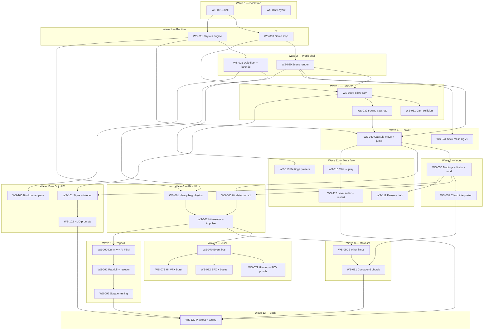

# John Stick — work streams (DAG) & agent checklist

**Purpose:** Topological order for implementation: **what unlocks what**, what can run **in parallel**, and which **Cursor role rule** (`@.cursor/rules/…`) fits each stream.  
**Source:** `docs/GAME_PLAN.md` implementation spine + tiers `[E]`/`[C]`/`[N]`.  
**How to use:** Check items `[x]` when done. Pick tasks whose **all** `Depends on` IDs are checked. **Parallel** = same wave, no dependency between them — assign different agents.

---

## Legend

| Field | Meaning |
|--------|---------|
| **Wave** | Rough phase (lower = earlier). |
| **Depends on** | IDs that must be done first (DAG edges). |
| **∥** | **Safe to parallelize** with listed IDs (same prerequisites, no edge between them). |
| **@rule** | Suggested Cursor rule file (see `john-stick-role-index.mdc`). |
| **GP §** | `GAME_PLAN` ingredient anchor (optional). |

---

## DAG overview (Mermaid)

*Arrows = “must complete before”. Tasks in the same row after a join can often run in parallel once their shared deps are met.*



---

## Quick reference table

| ID | Wave | Depends on | ∥ Parallel | @rule | Deliverable (short) |
|----|------|------------|------------|-------|------------------------|
| WS-001 | 0 | — | WS-002 | `role-web-tools-engineer` + `role-graphics-programmer` | Vite+TS+Three runs; blank frame |
| WS-002 | 0 | — | WS-001 | `@.cursor/rules/role-game-director.mdc` (Game Director) | `src/` layout, naming doc |
| WS-010 | 1 | WS-001 | WS-011 | `role-gameplay-programmer` | `update` / `fixedStep` / `render` |
| WS-011 | 1 | WS-001 | WS-010 | `role-physics-programmer` | Rapier world + floor + layers; loop hooks GP §4.2 |
| WS-020 | 2 | WS-010 | WS-021 | `role-graphics-programmer` | Lights, shadows, renderer config GP §4.1.1 |
| WS-021 | 2 | WS-011, WS-010 | WS-020 | `role-level-designer` + `role-physics-programmer` | Floor + bounds GP §7.2.1 |
| WS-030 | 3 | WS-020, WS-010 | — | `role-gameplay-programmer` | Fixed-pitch follow GP §3.1.1 |
| WS-031 | 3 | WS-030 | WS-032 | `role-gameplay-programmer` | Pull-in / collision GP §3.1.1 |
| WS-032 | 3 | WS-030 | WS-031 | `role-gameplay-programmer` | Facing yaw (A/D + strafe) GP §3.1.4 |
| WS-040 | 4 | WS-011, WS-032, WS-020 | WS-041 | `role-gameplay-programmer` + `role-physics-programmer` | Move + jump GP §3.3.1 |
| WS-041 | 4 | WS-020 | WS-040 | `role-technical-animator` + `role-character-artist` | glTF stick + walk cycle GP §5.2.1 |
| WS-050 | 5 | WS-040 | — | `role-gameplay-programmer` | 4 keys + Shift + interact GP §3.2.1 |
| WS-051 | 5 | WS-050 | — | `role-gameplay-programmer` | Chords + priority GP §3.2.4 |
| WS-060 | 6 | WS-050, WS-040 | WS-061 | `role-gameplay-programmer` | Hitbox + debug draw GP §6.2.1 |
| WS-061 | 6 | WS-011, WS-021 | WS-060 | `role-physics-programmer` + `role-level-designer` | Bag anchor GP §7.1.2 |
| WS-062 | 6 | WS-060, WS-061 | — | `role-gameplay-programmer` | Impulse + reaction on bag GP §2.4.1 |
| WS-070 | 7 | WS-062 | — | `role-gameplay-programmer` | `CombatHit` events GP §4.3.3 |
| WS-071 | 7 | WS-070 | WS-072, WS-073 | `role-gameplay-programmer` + `role-creative-director` | Hit-stop, FOV punch GP §6.3.1 |
| WS-072 | 7 | WS-070 | WS-071, WS-073 | `role-audio` | Web Audio buses + 1st SFX GP §8.2.1 |
| WS-073 | 7 | WS-070 | WS-071, WS-072 | `role-vfx-artist` + `role-graphics-programmer` | Burst / flash GP §6.3.2 |
| WS-080 | 8 | WS-062 | — | `role-lead-game-designer` + `role-gameplay-programmer` | 3 limbs + data table GP §2.2.1 |
| WS-081 | 8 | WS-051, WS-080 | — | `role-lead-game-designer` + `role-technical-animator` + `role-gameplay-programmer` | Compound moves GP §2.2.1 |
| WS-090 | 9 | WS-062 | — | `role-gameplay-programmer` | Dummy + states GP §2.1.2 |
| WS-091 | 9 | WS-090, WS-011 | — | `role-physics-programmer` + `role-technical-animator` | Ragdoll + get-up GP §6.1 |
| WS-092 | 9 | WS-091 | — | `role-lead-game-designer` + `role-physics-programmer` | Threshold tuning GP §6.1.2 |
| WS-100 | 10 | WS-021 | WS-101 | `role-environment-artist` + `role-art-director` | Replace placeholder geo GP §7.1 |
| WS-101 | 10 | WS-050, WS-030 | WS-100 | `role-level-designer` + `role-narrative-designer` | Signs + interact GP §2.4.2 |
| WS-102 | 10 | WS-101 | — | `role-ux-ui-designer` | Context prompts GP §9.1.2 |
| WS-110 | 11 | WS-040 | WS-113 | `role-ux-ui-designer` + `role-gameplay-programmer` | Title → dojo GP §9.2.1 |
| WS-111 | 11 | WS-050 | WS-113 | `role-ux-ui-designer` + `role-gameplay-programmer` | Pause + binding help GP §9.3.3 |
| WS-112 | 11 | WS-110 | — | `role-gameplay-programmer` + `role-web-tools-engineer` | `levelOrder` + restart GP §2.5 |
| WS-113 | 11 | WS-020 | WS-110, WS-111 | `role-graphics-programmer` + `role-ux-ui-designer` | Low/med/high presets GP §9.2.2 |
| WS-120 | 12 | WS-081, WS-092, WS-102, WS-112 | — | `role-qa-playtest` + `role-game-director` | Rubric pass, cut list GP §11.2 |

---

## Nested checklist (copy-friendly)

### Wave 0 — Bootstrap

- [x] **WS-001** — Vite + TypeScript + Three.js app runs; renderer clears; **no backend**.  
  - **Depends:** —  
  - **∥** WS-002  
  - **@** `role-web-tools-engineer` · `role-graphics-programmer`  
  - **GP** §4.4.1–4.4.2  

- [x] **WS-002** — Repo layout (`src/game`, `assets`, conventions) + README dev command.  
  - **Depends:** —  
  - **∥** WS-001  
  - **@** `@.cursor/rules/role-game-director.mdc` (Game Director — scope, sequencing, layout contract)  

### Wave 1 — Runtime core

- [x] **WS-010** — Game loop: `update`, `fixedStep` (~60Hz), `render`; no sim in render.  
  - **Depends:** WS-001  
  - **∥** WS-011  
  - **@** `role-gameplay-programmer`  
  - **GP** §4.3.1  

- [x] **WS-011** — Physics engine integrated; static floor; gravity; layers stub.  
  - **Depends:** WS-001  
  - **∥** WS-010  
  - **@** `role-physics-programmer`  
  - **GP** §4.2.1–4.2.3  

### Wave 2 — World shell

- [x] **WS-020** — Scene: lights, shadows, tone mapping, resize handling.  
  - **Depends:** WS-010  
  - **∥** WS-021 (after WS-011 exists)  
  - **@** `role-graphics-programmer`  
  - **GP** §4.1.1  

- [x] **WS-021** — Dojo floor + boundary colliders (placeholder geo OK).  
  - **Depends:** WS-011, WS-010  
  - **∥** WS-020 once WS-010 done  
  - **@** `role-level-designer` · `role-physics-programmer`  
  - **GP** §7.1.1, §7.2.1  

### Wave 3 — Camera (keyboard-only)

- [x] **WS-030** — Third-person follow, **fixed pitch**, targets player.  
  - **Depends:** WS-020, WS-010  
  - **@** `role-gameplay-programmer`  
  - **GP** §3.1.1  

- [x] **WS-031** — Camera collision pull-in so geometry does not swallow view.  
  - **Depends:** WS-030  
  - **∥** WS-032  
  - **@** `role-gameplay-programmer`  
  - **GP** §3.1.1  

- [x] **WS-032** — Keyboard yaw (e.g. **Q/E**); document camera vs character rotation choice.  
  - **Depends:** WS-030  
  - **∥** WS-031  
  - **@** `role-gameplay-programmer`  
  - **GP** §3.1.4, §3.4.1  

### Wave 4 — Player body

- [x] **WS-040** — Character controller (capsule): WASD/arrows, jump (**Space**), grounded tests.  
  - **Depends:** WS-011, WS-032, WS-020  
  - **∥** WS-041 (until mesh needed for ship polish)  
  - **@** `role-gameplay-programmer` · `role-physics-programmer`  
  - **GP** §3.3.1  

- [ ] **WS-041** — Stick character glTF + skinned idle/walk (replace capsule visual).  
  - **Depends:** WS-020  
  - **∥** WS-040 early; **must finish** before trailer polish / WS-120  
  - **@** `role-technical-animator` · `role-character-artist` · `role-technical-artist`  
  - **GP** §5.2.1, §5.3.1  

### Wave 5 — Combat input

- [ ] **WS-050** — Action map: **four limb keys**, **Shift** modifier, **interact** (signs), **no mouse** for core loop.  
  - **Depends:** WS-040  
  - **@** `role-gameplay-programmer`  
  - **GP** §3.2.1  

- [ ] **WS-051** — Chord / sequence interpreter + conflict priority (guard vs attack vs interact).  
  - **Depends:** WS-050  
  - **@** `role-gameplay-programmer` · `role-lead-game-designer`  
  - **GP** §3.2.3–3.2.4  

### Wave 6 — First contact (bag)

- [ ] **WS-060** — Hit detection v1 (one punch): shapes or sweep, **dev debug draw**.  
  - **Depends:** WS-050, WS-040  
  - **∥** WS-061  
  - **@** `role-gameplay-programmer`  
  - **GP** §6.2.1  

- [ ] **WS-061** — Punching bag rigid body + constraint / stand; reacts to impulse.  
  - **Depends:** WS-011, WS-021  
  - **∥** WS-060  
  - **@** `role-physics-programmer` · `role-level-designer`  
  - **GP** §7.1.2  

- [ ] **WS-062** — Connect hit → bag: damage/impulse application + first “feel” pass.  
  - **Depends:** WS-060, WS-061  
  - **@** `role-gameplay-programmer` · `role-lead-game-designer`  
  - **GP** §2.4.1, §6.2.2  

### Wave 7 — Juice

- [ ] **WS-070** — Combat event bus (`CombatHit`, etc.) → subscribers.  
  - **Depends:** WS-062  
  - **@** `role-gameplay-programmer`  
  - **GP** §4.3.3  

- [ ] **WS-071** — Hit-stop (tunable) + subtle FOV punch; accessibility hooks.  
  - **Depends:** WS-070  
  - **∥** WS-072, WS-073  
  - **@** `role-gameplay-programmer` · `role-creative-director`  
  - **GP** §6.3.1  

- [ ] **WS-072** — Web Audio buses + first impact SFX on event (see `role-audio` brief template).  
  - **Depends:** WS-070  
  - **∥** WS-071, WS-073  
  - **@** `role-audio`  
  - **GP** §8.2.1  

- [ ] **WS-073** — Hit VFX burst (particles or sprite) on event.  
  - **Depends:** WS-070  
  - **∥** WS-071, WS-072  
  - **@** `role-vfx-artist` · `role-graphics-programmer`  
  - **GP** §6.3.2  

### Wave 8 — Full moveset (horizontal)

- [ ] **WS-080** — Implement other three limb base attacks + designer table rows.  
  - **Depends:** WS-062  
  - **@** `role-lead-game-designer` · `role-gameplay-programmer` · `role-technical-animator`  
  - **GP** §2.2.1  

- [ ] **WS-081** — Compound chord moves + animations + hit profiles.  
  - **Depends:** WS-051, WS-080  
  - **@** `role-lead-game-designer` · `role-gameplay-programmer` · `role-technical-animator`  
  - **GP** §2.2.1–2.2.3  

### Wave 9 — Ragdoll target

- [ ] **WS-090** — Training dummy: state machine idle/stagger/hit (pre-ragdoll).  
  - **Depends:** WS-062  
  - **@** `role-gameplay-programmer`  
  - **GP** §2.1.2  

- [ ] **WS-091** — Ragdoll activation + recovery / blend to stance.  
  - **Depends:** WS-090, WS-011  
  - **@** `role-physics-programmer` · `role-technical-animator`  
  - **GP** §6.1  

- [ ] **WS-092** — Tune stagger → ragdoll thresholds with bag + dummy.  
  - **Depends:** WS-091  
  - **@** `role-lead-game-designer` · `role-physics-programmer`  
  - **GP** §6.1.2  

### Wave 10 — Dojo presentation

- [ ] **WS-100** — Environment art pass (replace graybox); materials per Art Director.  
  - **Depends:** WS-021  
  - **∥** WS-101  
  - **@** `role-environment-artist` · `role-art-director`  
  - **GP** §7.1  

- [ ] **WS-101** — Sign geometry + interact volumes + copy (keys & chords).  
  - **Depends:** WS-050, WS-030  
  - **∥** WS-100  
  - **@** `role-level-designer` · `role-narrative-designer`  
  - **GP** §2.4.2, §7.1.3  

- [ ] **WS-102** — HUD / screen prompts for interact + critical actions.  
  - **Depends:** WS-101  
  - **@** `role-ux-ui-designer`  
  - **GP** §9.1.2  

### Wave 11 — Meta & settings

- [ ] **WS-110** — Title flow → load dojo (level 0).  
  - **Depends:** WS-040  
  - **∥** WS-113  
  - **@** `role-ux-ui-designer` · `role-gameplay-programmer`  
  - **GP** §9.2.1  

- [ ] **WS-111** — Pause menu + help text (bindings match live config).  
  - **Depends:** WS-050  
  - **∥** WS-113  
  - **@** `role-ux-ui-designer` · `role-gameplay-programmer`  
  - **GP** §9.3.3, §3.4.2  

- [ ] **WS-112** — `levelOrder` data + restart + next level stub (client-only).  
  - **Depends:** WS-110  
  - **@** `role-gameplay-programmer` · `role-web-tools-engineer` · `role-lead-game-designer`  
  - **GP** §2.5  

- [ ] **WS-113** — Graphics presets (shadows/post/physics quality) wired.  
  - **Depends:** WS-020  
  - **∥** WS-110, WS-111  
  - **@** `role-graphics-programmer` · `role-ux-ui-designer`  
  - **GP** §9.2.2  

### Wave 12 — Lock / ship

- [ ] **WS-120** — Playtest rubric (laptop, **no mouse**), tuning tickets, cut list for ship.  
  - **Depends:** WS-081, WS-092, WS-102, WS-112  
  - **@** `role-qa-playtest` · `role-game-director` · `role-creative-director`  
  - **GP** §11.2, §1.3.1  

---

## Deferred bucket (V2+ / `[N]`) — not on critical path

Track separately; **do not start** before WS-120 unless explicitly pulling forward.

- [ ] **WS-200** — In-world story: inspectables + unkillable NPCs GP §7.4  
- [ ] **WS-201** — Additional levels + encounter director GP §7.3  
- [ ] **WS-202** — Faction outfits + enemy variety GP §10.2  
- [ ] **WS-203** — Blood / decals tier GP §6.3.4 `[N]`  
- [ ] **WS-204** — Gamepad rumble GP §8.3 `[N]`  
- [ ] **WS-205** — Optional mouse yaw only GP §3.2.2 `[N]`  
- [ ] **WS-206** — Online leaderboard / cloud GP §4.5 `[N]`  

---

## Agent handoff snippet (paste per task)

```text
@.cursor/rules/<rule>.mdc

Task: WS-0XX — <title from checklist>
Depends met: WS-aaa ✓, WS-bbb ✓
Deliverable: <one line>
Refs: docs/GAME_PLAN.md §…, docs/WORK_STREAMS.md
```

---

*Update this file when you split or merge streams; keep IDs stable so dependency references stay valid.*
